# User Interface
<small>CAS Arts & Design in Practice · Signalwerk GmbH – Stefan Huber · 2017</small>

::: TOC
**Content**
[[TOC]]
:::

## Intro
::: fig
[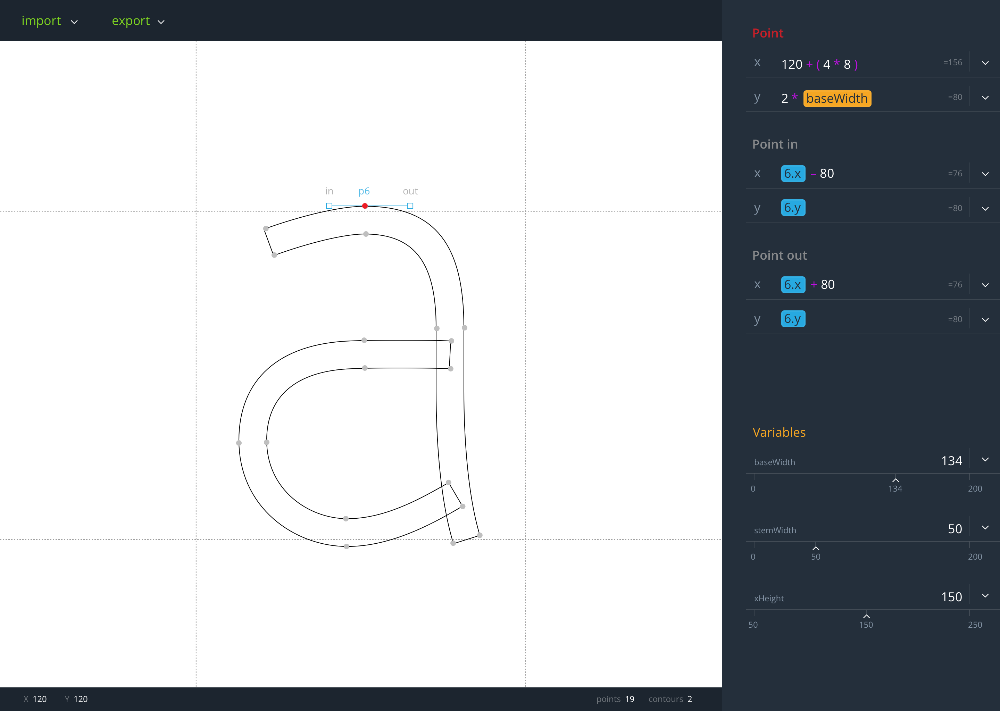](./sketch/Select.png)
*Overview of the GUI*
:::

The aim of the design was to build a single screen user interface with no switching between windows or overlays. All the interaction should be context sensitive and offer as less options as possible and as many as necessary. Noting like selecting a tool is required. All the interaction is just with the normal pointer and additional functions are added with key combinations. The interface is targeted at professional users.  

*Warning: All pictures are scaled. Click on it to see the original file.*

## Drawing

::::: grid

:::: col_1of2
::: fig
[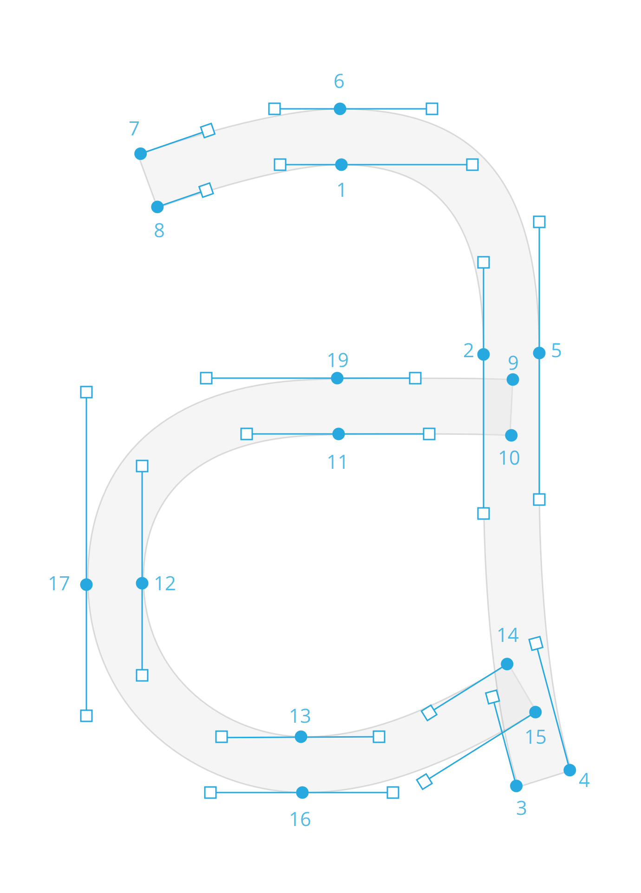](./sketch/a_anchor.png)
*Point Editing for contours*
:::
::::

:::: col_1of2_last
::: fig
[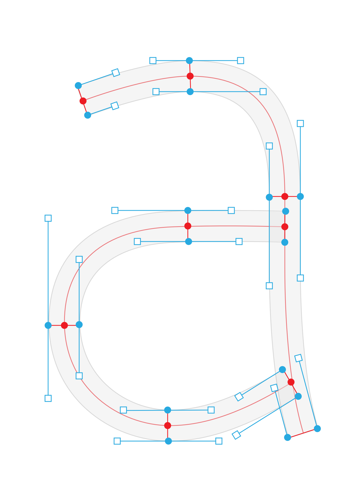](./sketch/a_skelet.png)
*Brush Editing for strokes*
:::
::::

:::::

There are two kind of drawing modes. The outline based editing is well known by regular vector drawing programs like Illustrator or Inkscape. In addition to that there will be a stroke based drawing ((not planned for the first beta)). This model is similar to the approach of [prototypo](https://www.prototypo.io/). The centerline is defined by stroke points. Those points extend to the outer shape of the glyph. 

## Parts
The GUI consists of the following parts:

* Art board
* Palette
* Menu bar
* Status bar

### Art board
::: fig
[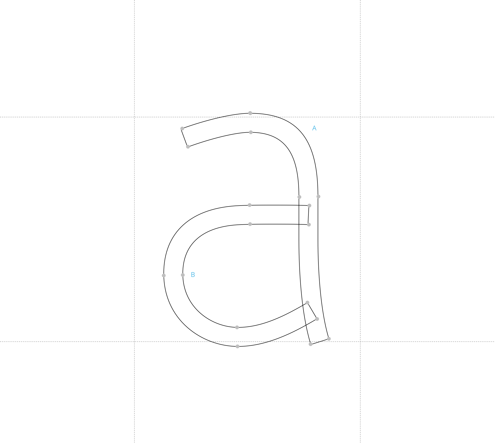](./sketch/drawing.png)
*Art board without a selection*
:::
The visual representation of the drawing is visible on the artboard. The default mouse behaviour (tool) is to select and move points. If the control-key is held down it is possible to draw a path.  
((no zoom/move planned for the first beta))

Hold down x-key to see a proof view of the glyph. 
::: fig fig_1of3

*Proof view*
:::

---

### Palette
::: fig fig_1of3
[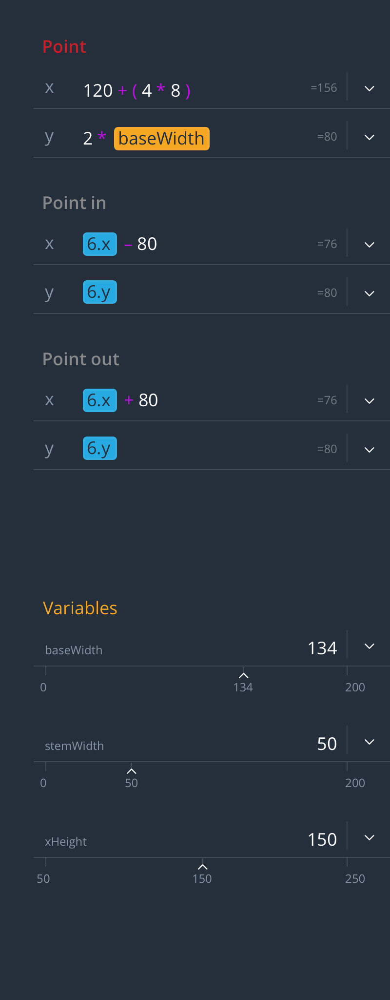](./sketch/Palette_Select.png)
*Palette with a selected point in the art board*
:::
The Palette changes it's content depending on the selection on the art board. The importance and usage of the different input fields are decreasing from top to down.
Always (even if not visible on the sketches) at the very bottom in all context there will be the section with the variables. 

---

### Menu bar
::: fig
[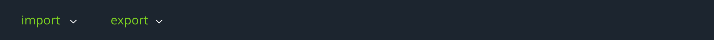](./sketch/menu.png)
*Menu bar*
:::
The menu bar offers usually non context-sensitive data. 

#### Items
* Import ((not planned for the first beta))
* Export ((not planned for the first beta))

---

### Status bar
::: fig
[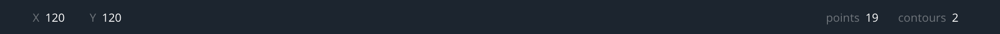](./sketch/status.png)
*Status bar*
:::
The status bar shows general informations to the current status of the editing.

#### Information
* x-Position of the mouse pointer
* y-Position of the mouse pointer
* total count of contours in the glyph
* total count of points in the glyph

---

## Colour palette
The colours of the whole GUI are in a dark tone only the art board has a white background to have a contrast between the functional interface and the visual representation.

The following colours have an extended colour encoding:
* Cyan: path geometry (glyph, contour, point)
* Red: current active
* Orange: variables

::: fig fig_1of2 fig_noOutline
[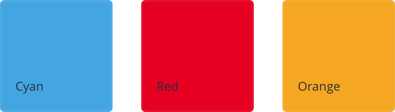](./sketch/colours.png)
*color*
:::

## Glyph Editing

::: fig

*Properties regarding the glyph*
:::
The overview of the glyph shows the basic informations to the metrics and the name. In addition there is a tree view of the whole glyph structure visible. 
This screen always shows up if there is no selection of any path or point.
In the tree view there is also the option to convert a outline path (default) to a stroke path ((not planned for the first beta)).

### Information
* Glyph-Name (important for export)
* Left Side Bearing (LSB) 
* Right Side Bearing (RSB)
* Tree view of the glyph construction
* Variables

## Point Editing (contours)
::: fig

*Editing a point on a contour*
:::
If a contour is based on contour points (like in Illustrator) each point on a curve will also have off-curve points. «Point in» and «Point out» are only visible if the on curve point is selected. 

### Information
* On curve point
* Off curve points
* Variables

## Brush Editing (stroke)
((not planned for the first beta))

::: fig

*Editing a point in a stroke*
:::
If the glyph is based on a stroke, each point (p6 in the Figure) on the skeleton of the glyph extends to six points. Two on-curve points (a6, b6 in the Figure) and four off-curve points (aIn, aOut, bIn, bOut in the Figure). 

*The red line of the skeleton is just to visualise the concept. It will not be part of the program, since it is not needed.*

### Information
* Stroke width
* Stroke angel
* Balance (define where the stroke will be set on the skelet- line)
* On curve point A & B
* Off curve points A & B
* Variables

## Key Components
The interface has recurring components to build the GUI. The most important components are the parts to build up the parameters and the formulas for the shapes. 

### Input field

::: fig fig_1of2
[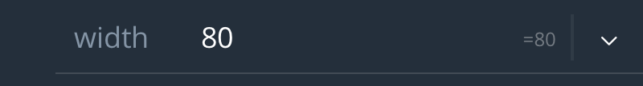](./sketch/Input.png)
*Numeral input*
:::

::: fig fig_1of2
[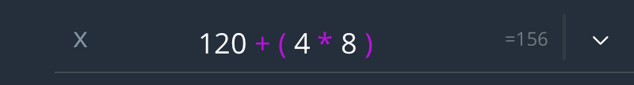](./sketch/Input_Calc.png)
*Calculations*
:::

::: fig fig_1of2
[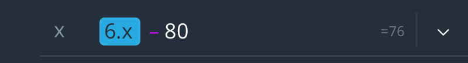](./sketch/Input_point.png)
*Formula with geometry references*
:::

::: fig fig_1of2
[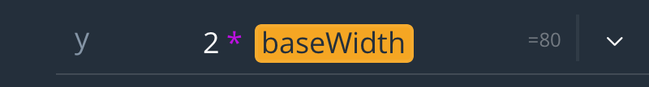](./sketch/Input_Var.png)
*Formula with variable*
:::

::: fig fig_1of2
[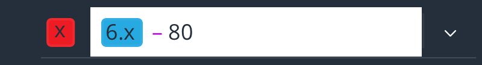](./sketch/Input_Edit.png)
*Editing a formula*
:::

Formulas and numeral inputs are filled into input fields. The coder/designer should get a visual representation what type of the input each part is. This information is primarly colour encoded.

#### Focus 
If the focus is on the input field all other UI elements fade dark. All elements in bright colours stick out and can be clicked to get a reference of the clicked element in the formula.

::::: overlay

:::: one
::: fig

*Inactive inputfield integratet in the GUI*
:::
::::

:::: two
::: fig

*Interface when inputfield is active*
:::
::::

:::::

### Variables 

::: fig fig_1of2
[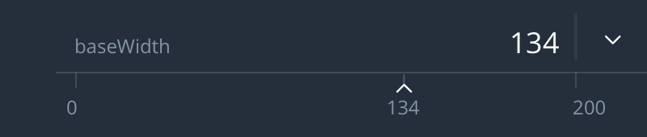](./sketch/Variable.png)
*Variable with integrated slider*
:::
Variables can be typed as regular numbers or they can be changed by dragging a slider between a predefined minimum and maximum (settings in the triangle-menu).

## Next steps
((not planned for the first beta))  

To further improve the overview of the drawings and to keep order in the process of shaping the different parts of a character there could be done some more improvements.

### Tags
Each point and every contour could get a tag. These tags could then be shown and hide similar to a layer system but because in typedesign a layer has no significance there is no need for a top to bottom (front to back) order. But with tags an element could have several tags and if one tag gets hidden the part gets hidden. It would offer a more flexible way than a layer system.

### Multiple Glyphs
Right now the whole concept is just do draw one single glyph. In the future there should be an option to draw a whole font.

### Global and local variables
Variables should have the ability to be local to one glyph or global available to the whole font. 

 
 
 
 
 
####Source on GitHub
<small>[Fix my mistakes on GitHub](https://github.com/signalwerk/paramatters/blob/master/pages/ui/index.md)</small>
